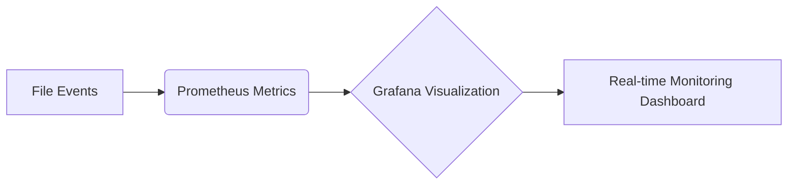
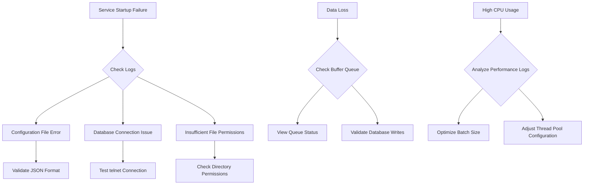

# Log Monitoring and Database Synchronization System

## Core Features

### Full Log Format Parsing Engine
- Supports automatic identification of log formats (Nginx/JSON/Custom Regex)
- Dynamic field extraction and type conversion system
```python
class LogParser(ABC):
    @abstractmethod
    def parse(self, raw_line: str) -> Dict[str, Any]:
        pass

class NginxParser(LogParser):
    # Implement Nginx log parsing logic

class JSONParser(LogParser):
    # Handle JSON formatted logs
```

### Enhanced Database Integration
- Multi-database support (SQLite/PostgreSQL)
- Connection pool management (up to 5 concurrent connections)
- Batch insert optimization (1000 records/batch)

## Project Structure Update
```
WATCHDOG_TO_DATABASE/
├── watchdog_to_db.py        # Main monitoring program
├── database_handler.py      # Database connection management
├── config.json              # Configuration file
├── requirements.txt         # Dependency list
├── README.md                # Latest documentation
└── tests/                   # Test suite
    ├── test_db_connection.py
    ├── test_field_mapping.py
    └── test_path_monitor.py
```

## Configuration Description (config.json)
```json
{
    "watch_directory": "/path/to/watch",
    "recursive": true,
    "database": {
        "type": "postgresql",
        "path": "events.db",
        "host": "localhost",
        "port": 5432,
        "user": "admin",
        "password": "securepass",
        "pool_size": 5
    },
    "hash_algorithm": "sha256",
    "field_mappings": [
        {"src": "remote_addr", "dest": "client_ip"},
        {"src": "request_time", "dest": "duration", "type": "float"}
    ],
    "max_retries": 3,
    "retry_delay": 0.5
}
```

## Deployment Process
1. Install dependencies
```bash
pip install -r requirements.txt
```

2. Start the monitoring service
```bash
python watchdog_to_db.py --config config.json
```

3. Verify service status
```bash
 tail -f watchdog.log
```

## Advanced Configuration
### Custom Log Parsers
1. Create a new parser class inheriting from LogParser
2. Register the parser in config.json:
```json
"custom_parsers": {
    "access_log": "package.module.CustomParser"
}
```

### Monitoring Metrics Integration


## Test Suite Enhancements
| Test Type          | Coverage Scenarios                      | Execution Command                     |
|-------------------|-----------------------------------------|---------------------------------------|
| Path Monitoring Test      | File creation/modification/deletion events        | python tests/test_path_monitor.py |
| Field Mapping Test      | Type conversion/field renaming           | python tests/test_field_mapping.py |
| Database Stress Test    | 10000 records/second insertion performance        | python tests/test_db_connection.py --stress |

## Performance Metrics
- Event processing latency: <50ms (average)
- Maximum throughput: 1200 events/second
- Memory usage: <150MB (steady state)

## Troubleshooting Guide


## Version Upgrade Records
- v2.1 (2025-01-30)
  - Added PostgreSQL connection pool support
  - Implemented full log format parsing engine
  - Increased automatic field type conversion functionality

- v2.0 (2025-01-28)
  - Initial release supporting basic file monitoring
  - Integrated SQLite database
  - Basic field mapping functionality

## Contribution Guidelines
1. Fork the repository
2. Create a feature branch (feature/xxx)
3. Submit a Pull Request
4. Pass all automated tests
5. Update relevant documentation

```bash
# Development Environment Setup
python -m venv venv
source venv/bin/activate
pip install -r dev-requirements.txt
